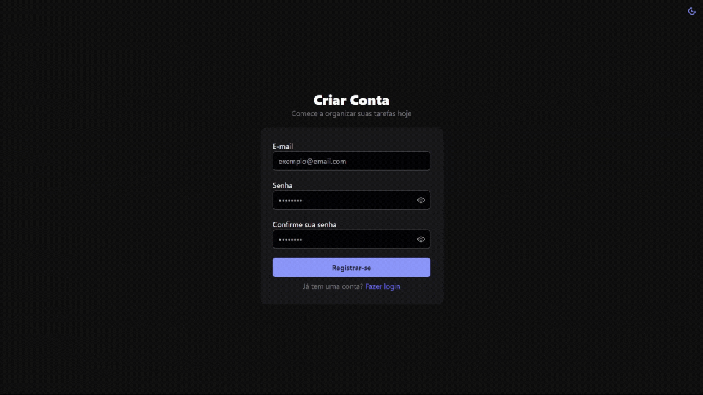
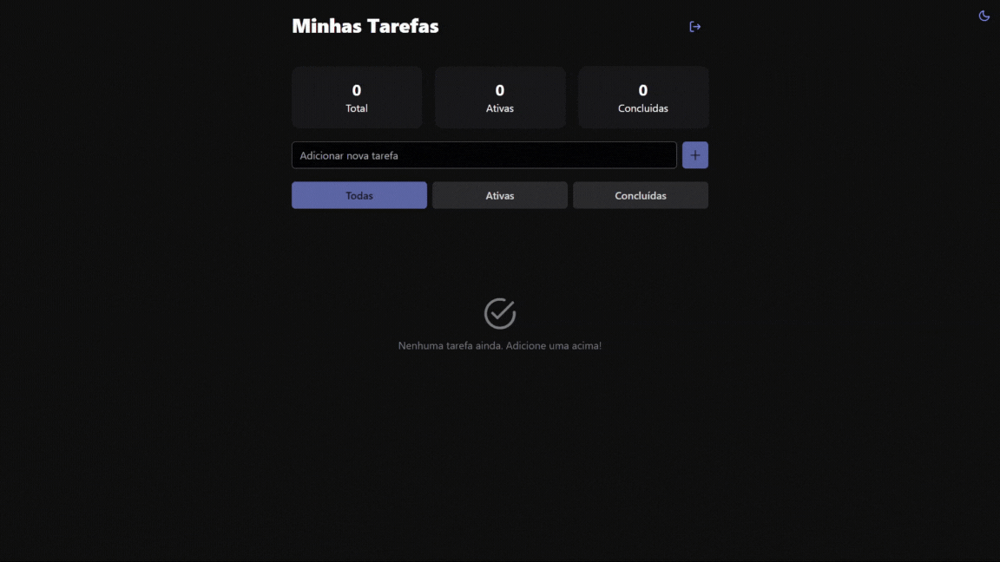
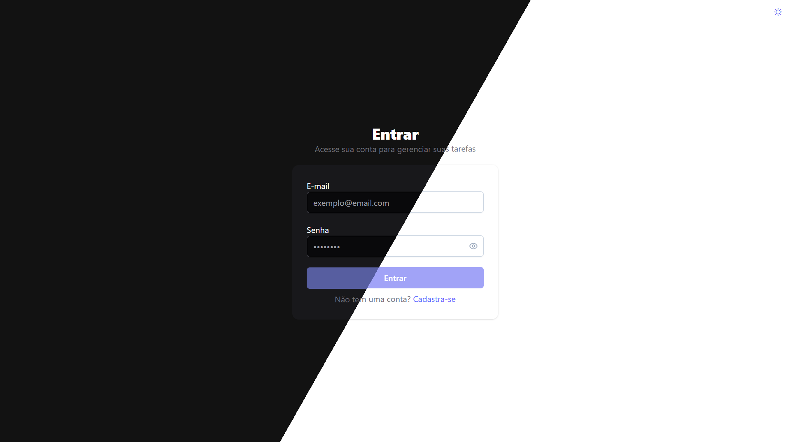
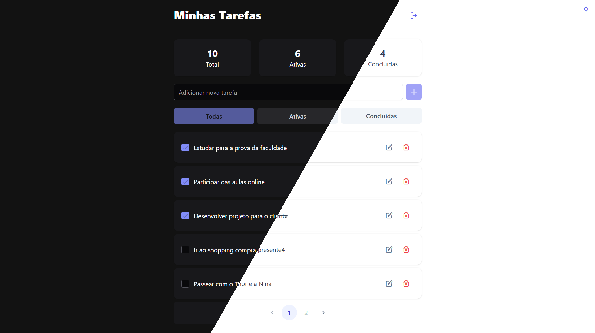

# TaskFlow Web

Interface web moderna para gerenciamento de tarefas desenvolvida em Angular, que se conecta à [API TaskFlow](https://github.com/sousaarthur/TaskFlow_api) para oferecer uma experiência completa de produtividade.

## 📋 Índice

- [Sobre o Projeto](#sobre-o-projeto)
- [Funcionalidades](#funcionalidades)
- [Tecnologias](#tecnologias)
- [Pré-requisitos](#pré-requisitos)
- [Instalação](#instalação)
- [Como Executar](#como-executar)
- [Estrutura do Projeto](#estrutura-do-projeto)
- [Componentes](#componentes)
- [Serviços](#serviços)
- [Interfaces](#interfaces)
- [Roteamento](#roteamento)
- [Temas](#temas)
- [Screenshots](#screenshots)
- [Build](#build)
- [Testes](#testes)
- [API Integration](#api-integration)

## 🚀 Sobre o Projeto

TaskFlow Web é uma aplicação frontend moderna construída com Angular que oferece uma interface intuitiva para gerenciamento de tarefas. A aplicação se comunica com a API TaskFlow para fornecer funcionalidades completas de CRUD de tarefas, autenticação JWT e estatísticas em tempo real.

### ✨ Principais Características

- 🎨 Interface moderna e responsiva com PrimeNG
- 🌓 Suporte a modo escuro/claro
- 🔐 Autenticação JWT integrada
- 📊 Dashboard com estatísticas em tempo real
- 📱 Design responsivo
- ⚡ Performance otimizada com Zoneless Change Detection
- 🎯 Arquitetura modular e escalável

## 🛠 Funcionalidades

### Autenticação
- ✅ Login com validação de email e senha
- ✅ Registro de novos usuários
- ✅ Proteção de rotas com AuthGuard
- ✅ Interceptor automático para tokens JWT
- ✅ Logout seguro

### Gerenciamento de Tarefas
- ✅ Criação de novas tarefas
- ✅ Visualização de tarefas em lista paginada
- ✅ Edição inline de tarefas
- ✅ Marcação de tarefas como concluídas
- ✅ Exclusão de tarefas
- ✅ Filtros (Todas, Ativas, Concluídas)
- ✅ Paginação com controle de tamanho

### Dashboard
- ✅ Estatísticas em tempo real
- ✅ Contador de tarefas totais, ativas e concluídas
- ✅ Atualização automática de dados

### Interface
- ✅ Tema escuro/claro com persistência
- ✅ Notificações toast para feedback
- ✅ Loading states e tratamento de erros
- ✅ Design responsivo

## 🛠 Tecnologias

- **Angular 20.2.0** - Framework principal
- **TypeScript 5.9** - Linguagem de programação
- **PrimeNG 20.2.0** - Biblioteca de componentes UI
- **PrimeIcons 7.0** - Ícones
- **Tailwind CSS 4.1** - Framework de CSS utilitário
- **RxJS 7.8** - Programação reativa
- **Angular Router** - Navegação SPA
- **Angular Forms** - Formulários reativos
- **Angular HTTP Client** - Comunicação com API

### Ferramentas de Desenvolvimento

- **Angular CLI 20.2.0** - Ferramenta de desenvolvimento
- **TypeScript** - Tipagem estática

## 📋 Pré-requisitos

Antes de executar o projeto, certifique-se de ter:

- [Node.js 18+](https://nodejs.org/) instalado
- [npm 9+](https://www.npmjs.com/) ou [yarn](https://yarnpkg.com/)
- [Angular CLI 20+](https://cli.angular.io/) instalado globalmente
- [TaskFlow API](https://github.com/sousaarthur/TaskFlow_api) rodando em `http://localhost:8080`

## 🔧 Instalação

1. **Clone o repositório:**
   ```bash
   git clone https://github.com/seu-usuario/TaskFlow_web.git
   cd TaskFlow_web
   ```

2. **Instale as dependências:**
   ```bash
   npm install
   ```
   
   Ou usando yarn:
   ```bash
   yarn install
   ```

3. **Certifique-se de que a API está rodando:**
   - A aplicação espera que a API esteja disponível em `http://localhost:8080`
   - Consulte a documentação da [TaskFlow API](../TaskFlow_api/README.md) para configuração

## 🚀 Como Executar

### Desenvolvimento

```bash
npm start
# ou
ng serve
```

A aplicação estará disponível em `http://localhost:4200/`

### Modo de Desenvolvimento com Watch

```bash
npm run watch
# ou
ng build --watch --configuration development
```

## 📁 Estrutura do Projeto

```
src/
├── app/
│   ├── components/           # Componentes reutilizáveis
│   │   └── switch-theme/     # Componente de alternância de tema
│   ├── interfaces/           # Definições de tipos TypeScript
│   │   ├── statsInterface.ts     # Interface para estatísticas
│   │   ├── taskInterface.ts      # Interface para tarefas
│   │   └── userInterface.ts      # Interface para usuários
│   ├── pages/               # Páginas/Views da aplicação
│   │   ├── login/           # Página de login
│   │   ├── register/        # Página de registro
│   │   └── main/           # Página principal (dashboard)
│   ├── services/           # Serviços e utilitários
│   │   ├── authGuard.ts        # Guard de autenticação
│   │   ├── authInterceptor.ts  # Interceptor JWT
│   │   ├── authService.ts      # Serviço de autenticação
│   │   └── task.ts            # Serviço de tarefas
│   ├── app.config.ts       # Configuração da aplicação
│   ├── app.routes.ts       # Configuração de rotas
│   └── app.ts             # Componente raiz
├── index.html             # HTML principal
├── main.ts               # Bootstrap da aplicação
├── mypreset.ts           # Preset customizado do PrimeNG
└── styles.css            # Estilos globais
```

## 🧩 Componentes

### SwitchTheme
Componente responsável pela alternância entre tema claro e escuro.

**Funcionalidades:**
- Persistência da preferência no localStorage
- Ícone dinâmico (sol/lua)
- Aplicação automática do tema salvo

**Uso:**
```html
<app-switch-theme></app-switch-theme>
```

## 🔧 Serviços

### AuthService
Gerencia autenticação de usuários.

**Métodos:**
- `login(data)`: Autentica usuário
- `register(data)`: Registra novo usuário
- `isLoggedIn()`: Verifica se usuário está autenticado

### Task (TaskService)
Gerencia operações de tarefas.

**Métodos:**
- `createTask(data)`: Cria nova tarefa
- `listTask(page, size, completed?)`: Lista tarefas com paginação
- `updateTask(data)`: Atualiza tarefa existente
- `deleteTask(id)`: Remove tarefa
- `getStatsTask()`: Obtém estatísticas das tarefas

### AuthGuard
Protege rotas que requerem autenticação.

### AuthInterceptor
Adiciona automaticamente o token JWT às requisições HTTP.

## 📐 Interfaces

### TaskInterface
```typescript
interface TaskInterface {
  id: number;
  title: string;
  description: string;
  completed: boolean;
}
```

### UserInterface
```typescript
interface UserInterface {
  login: string;
  password: string;
}
```

### StatsInterface
```typescript
interface StatsInterface {
  totalTasks: number;
  completedTasks: number;
  activeTasks: number;
}
```

## 🗺 Roteamento

| Rota | Componente | Descrição | Guard |
|------|------------|-----------|-------|
| `/` | Main | Dashboard principal | ✅ AuthGuard |
| `/login` | Login | Página de login | ❌ |
| `/register` | Register | Página de registro | ❌ |
| `/**` | - | Redirect para `/` | - |

## 🎨 Temas

A aplicação suporta dois temas:

- **Tema Claro**: Padrão, com cores claras
- **Tema Escuro**: Ativado pela classe `.my-app-dark` no elemento `<html>`

### Configuração do Tema

O tema é configurado através do preset customizado em `mypreset.ts` e gerenciado pelo componente `SwitchTheme`.

## 📱 Screenshots

### Página de Login


### Dashboard Principal



### Tema Escuro



## 🔨 Build

### Build de Produção

```bash
npm run build
# ou
ng build
```

Os arquivos de build serão gerados no diretório `dist/`.

### Build de Desenvolvimento

```bash
npm run build:dev
# ou
ng build --configuration development
```

### Configurações de Build

- **Produção**: Otimização habilitada, source maps desabilitados
- **Desenvolvimento**: Otimização desabilitada, source maps habilitados

## 🔗 API Integration

### Configuração da API

A aplicação está configurada para se conectar com a API em:
- **URL Base**: `http://localhost:8080`
- **Endpoints de Auth**: `/auth/login`, `/auth/register`
- **Endpoints de Tasks**: `/task/*`

### Headers de Autenticação

O `AuthInterceptor` adiciona automaticamente o header:
```
Authorization: Bearer <token>
```

## 📦 Scripts Disponíveis

```json
{
  "ng": "ng",
  "start": "ng serve",
  "build": "ng build",
  "watch": "ng build --watch --configuration development",
  "test": "ng test"
}
```

## 🚀 Deploy

### Build para Produção

1. Execute o build:
   ```bash
   npm run build
   ```

2. Os arquivos estarão em `dist/TaskFlow_site/`

3. Sirva os arquivos estáticos com qualquer servidor web

### Variáveis de Ambiente

Para diferentes ambientes, ajuste as URLs da API nos serviços:
- Development: `http://localhost:8080`
- Production: `https://sua-api.com`

## 🤝 Contribuição

1. Fork o projeto
2. Crie uma branch para sua feature (`git checkout -b feature/nova-feature`)
3. Commit suas mudanças (`git commit -am 'Adiciona nova feature'`)
4. Push para a branch (`git push origin feature/nova-feature`)
5. Abra um Pull Request

## 📄 Licença

Este projeto está licenciado sob a [MIT License](LICENSE).

## 👨‍💻 Autor

Desenvolvido por **Arthur Sousa** (@arthurdev_.)

## 🔗 Links Relacionados

- [TaskFlow API](https://github.com/sousaarthur/TaskFlow_api) - Backend da aplicação
- [Angular Documentation](https://angular.dev/)
- [PrimeNG Documentation](https://primeng.org/)
- [Tailwind CSS Documentation](https://tailwindcss.com/)

---

⭐ Se este projeto foi útil para você, considere dar uma estrela no repositório!
